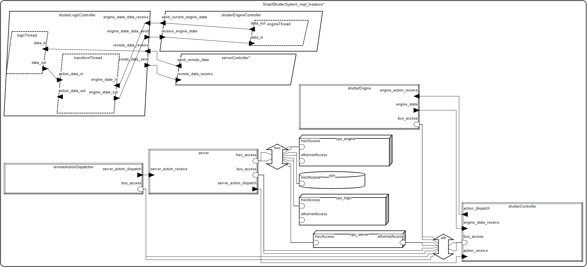

# System sterowania żaluzjami

## Autor
Maksymilian Katolik

maxkat@student.agh.edu.pl

## Opis projektu
Opis ogólny

Projekt przedstawia architekturę inteligentnego systemu sterowania żaluzjami okiennymi, który umożliwia ręczne sterowanie poziomem otwarcia żaluzji. System składa się z kilku współdziałających modułów, z których każdy realizuje inną część funkcjonalności, od przetwarzania danych po wykonanie poleceń.

Część sprzętowa obejmuje urządzenia wykonawcze (silniki żaluzji), procesory, pamięci oraz połączenia komunikacyjne. Warstwa logiczna systemu realizowana jest przez wyspecjalizowane komponenty oprogramowania (np. serwer automatyki, dispatcher akcji użytkownika - aplikacja), które są powiązane ze sprzętem i współdziałają za pośrednictwem zdefiniowanych interfejsów.

Model wykonano w języku AADL w celu umożliwienia dalszej analizy właściwości pozafunkcjonalnych (np. wykorzystanie zasobów, spójność połączeń, analiza wag i przepustowości). System nadaje się do dalszej implementacji na platformie wbudowanej.

\
Opis dla użytkownika

System umożliwa użytkowinikowi zdalne sterowanie żaluzjami za pomocą aplikacji zainstalowanek np. na jego telefonie.

## Opis systemu

### Diagram systemu

### Podkomponenty i połączenia między nimi:
Podsystemy (devices, processes, processor, buses):\
remoteActionDispatcher: odbiera zdalne polecenia.\
server: serwer sterujący systemem.\
shutterEngine: silnik żaluzji.\
shutterController: jednostka zarządzająca żaluzją.\
cpu, ram: procesor i pamięć.\
eth, hwc: magistrale (Ethernet, połączenie sprzętowe).

### Procesy (logika aplikacyjna):
ServerController: zarządza zdalnymi komendami.\
ShutterLogicController: podejmuje decyzje na podstawie komend i stanu silnika.\
ShutterEngineController: kontroluje silnik na podstawie stanu.

### Połączenia:
Łączą komponenty przez: magistrale (bus access), porty danych (port)

### Procesy i implementacje
ServerController
Zajmuje się odbieraniem i przekazywaniem zdalnych danych.\
Ma wątek ProcessRemoteDataThread, który przetwarza dane.

LogicController\
Logika podejmowania decyzji:\
Odbiera zdalne dane (remote_data_receive)\
Odbiera stan silnika (engine_state_data_receive)\
Wysyła nowe komendy (send_engine_state_data)\
Wysyła zaktualizowane dane (send_remote_data)\
Składa się z:\
LogicControllerThread: przetwarza komendy.\
LogicTransformThread: przekształca dane na działania silnika.

EngineController
Zajmuje się aktualnym stanem silnika. Jeden wątek:\
EngineControllerThread: przesyła aktualny stan silnika.

### Wątki
Każdy wątek:\
odbiera dane,\
przetwarza,\
przesyła dalej.

### Urządzenia (devices)
remote_action_dispatcher: wysyła akcje do serwera.\
smart_server: przetwarza i wysyła polecenia.\
shutter_engine: odbiera komendy i wysyła aktualny stan.\
shutter_controller: integruje dane z serwera i silnika.

### Procesory
CPU - główny procesor odpowiedzialny jest za odpowiednią pracę komponentów

## Analizy

### Weight Totals Report
	
eth: [L] Sum of weights / gross weight is 0,075 kg (no limit specified)\
hwc: [L] Sum of weights / gross weight is 0,075 kg (no limit specified)\
remoteActionDispatcher: [L] Sum of weights / gross weight is 0,400 kg (no limit specified)\
server: [L] Sum of weights / gross weight is 1,500 kg (no limit specified)\
shutterEngine: [L] Sum of weights / gross weight is 2,000 kg (no limit specified)\
shutterController: [L] Sum of weights / gross weight is 0,500 kg (no limit specified)\
ram: [L] Sum of weights / gross weight is 0,025 kg (no limit specified)\
cpu_server: [L] Sum of weights / gross weight is 0,700 kg (no limit specified)\
cpu_logic: [L] Sum of weights / gross weight is 0,700 kg (no limit specified)\
cpu_engine: [L] Sum of weights / gross weight is 0,700 kg (no limit specified)\
SmartShutterSystem_impl_Instance: [A] Sum of weights (6,675 kg) is below weight limit of 9,000 kg (25,8 % Weight slack)

### Not Bound Resource Budget Analysis Report
	

Resource Summary:\
MIPS capacity 300,000 MIPS : MIPS budget 55,000 MIPS\
3 out of 3 with MIPS capacity\
7 out of 7 with MIPS budget		

Detailed Processor MIPS Capacity Report	
		
Component	Capacity:\
processor cpu_server	 100,000 MIPS\
processor cpu_logic	 100,000 MIPS\
processor cpu_engine	 100,000 MIPS\
Total	 300,000 MIPS

		
### Bound Resource Budget Analysis Report

Processor Summary Report:\
  Processor cpu_server: Total MIPS 15,000 MIPS of bound tasks within MIPS capacity 100,000 MIPS of cpu_server\
  Processor cpu_logic: Total MIPS 30,000 MIPS of bound tasks within MIPS capacity 100,000 MIPS of cpu_logic\
  Processor cpu_engine: Total MIPS 10,000 MIPS of bound tasks within MIPS capacity 100,000 MIPS of cpu_engine

### Bus load analysis of SmartShutterSystem_impl_Instance

| Physical Bus | Capacity (KB/s) | Budget (KB/s) | Required Budget (KB/s) | Actual (KB/s) |
|--------------|------------------|---------------|--------------------------|----------------|
| eth          | 12500.0          | 125.0         | 0.0                      | 0.21333333333333337 |
| hwc          | 12500.0          | 125.0         | 0.0                      | 0.0               |

### Check connection binding consistency Report

ERROR:  logicThread.data_out -> transformThread.action_data_in: Hardware (processor or device) of connection source and destination are not physically connected by bus.\

Jest to jedyny błąd, którego nie byłem w stanie rozwiązać

### Port Connection Consistency Report
Nie zwrócił żadnych błędów czy ostrzeżeń

## Literatura
-   [CASE AADL Tutorial](https://github.com/GaloisInc/CASE-AADL-Tutorial/tree/main/aadl_book) - główne źródło znajomości komponentów w AADL

